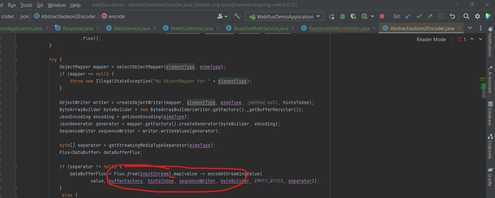

# WEBFLUX DEMO
- by adding the below (produces = MediaType.TEXT_EVENT_STREAM_VALUE) to the controller, the publisher can event data as they are produced
```java

    @GetMapping(value = "table/{input}/stream", produces = MediaType.TEXT_EVENT_STREAM_VALUE)

```

# when subscriber cancels
- in the traditional mvc: we see that even when the user cancels the process **still continues to the end**
  - as the server received no notification
- HOWEVER ,in reactive programming, when the subscriber cancels it halts immediately
  - as the publisher receives instant notification
    - ALSO NOTE: this is generic to reactive webflux and not the MediaType.TEXT_EVENT_STREAM_VALUE
    - test by calling endpoint without produces for flux and observe the same behavior


- note the reason why the data waits for the whole duration before emitting in spring 2.X is because
  - Flux is collected to List before mapping
  - in spring 3.X the collectList() was removed
  - found in **AbstractJackson2Encoder**
